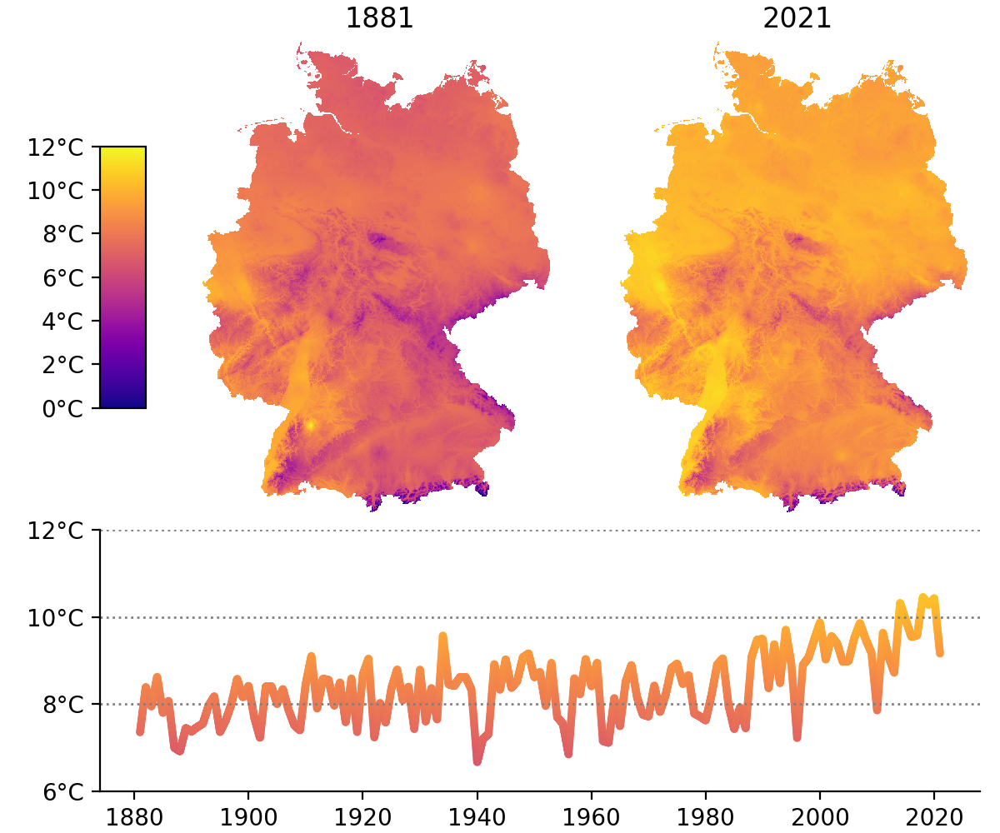

# Climate Germany

## DWD climate data

Climate data of Germany on a 1km grid can be downloaded from the DWD
(Deutscher Wetterdienst) at
[opendata.dwd.de](http://opendata.dwd.de/climate_environment/CDC/grids_germany/):

```bash
> wget -r -np -nH --cut-dirs=3 http://opendata.dwd.de/climate_environment/CDC/grids_germany/annual/air_temperature_mean/
> cd annual/air_temperature_mean/
> gunzip *.gz
```
retrieves annual mean air temperatures into `annual/`.

Here is a list of all available annual data:

- [air_temperature_max](http://opendata.dwd.de/climate_environment/CDC/grids_germany/annual/air_temperature_max/)
- [air_temperature_mean](http://opendata.dwd.de/climate_environment/CDC/grids_germany/annual/air_temperature_mean/)
- [air_temperature_min](http://opendata.dwd.de/climate_environment/CDC/grids_germany/annual/air_temperature_min/)
- [drought_index](http://opendata.dwd.de/climate_environment/CDC/grids_germany/annual/drought_index/)
- [erosivity](http://opendata.dwd.de/climate_environment/CDC/grids_germany/annual/erosivity/)
- [frost_days](http://opendata.dwd.de/climate_environment/CDC/grids_germany/annual/frost_days/)
- [hot_days](http://opendata.dwd.de/climate_environment/CDC/grids_germany/annual/hot_days/)
- [ice_days](http://opendata.dwd.de/climate_environment/CDC/grids_germany/annual/ice_days/)
- [phenology](http://opendata.dwd.de/climate_environment/CDC/grids_germany/annual/phenology/)
- [precipGE10mm_days](http://opendata.dwd.de/climate_environment/CDC/grids_germany/annual/precipGE10mm_days/)
- [precipGE20mm_days](http://opendata.dwd.de/climate_environment/CDC/grids_germany/annual/precipGE20mm_days/)
- [precipGE30mm_days](http://opendata.dwd.de/climate_environment/CDC/grids_germany/annual/precipGE30mm_days/)
- [precipitation](http://opendata.dwd.de/climate_environment/CDC/grids_germany/annual/precipitation/)
- [radiation_diffuse](http://opendata.dwd.de/climate_environment/CDC/grids_germany/annual/radiation_diffuse/)
- [radiation_direct](http://opendata.dwd.de/climate_environment/CDC/grids_germany/annual/radiation_direct/)
- [radiation_global](http://opendata.dwd.de/climate_environment/CDC/grids_germany/annual/radiation_global/)
- [snowcover_days](http://opendata.dwd.de/climate_environment/CDC/grids_germany/annual/snowcover_days/)
- [summer_days](http://opendata.dwd.de/climate_environment/CDC/grids_germany/annual/summer_days/)
- [sunshine_duration](http://opendata.dwd.de/climate_environment/CDC/grids_germany/annual/sunshine_duration/)
- [vegetation_begin](http://opendata.dwd.de/climate_environment/CDC/grids_germany/annual/vegetation_begin/)
- [vegetation_end](http://opendata.dwd.de/climate_environment/CDC/grids_germany/annual/vegetation_end/)

## Mean annual air temperature

Data are available from 1881 on.



Well, mean air temperature is steadily raising from about 1980 on!

See also [wikipedia](https://de.wikipedia.org/wiki/Zeitreihe_der_Lufttemperatur_in_Deutschland)